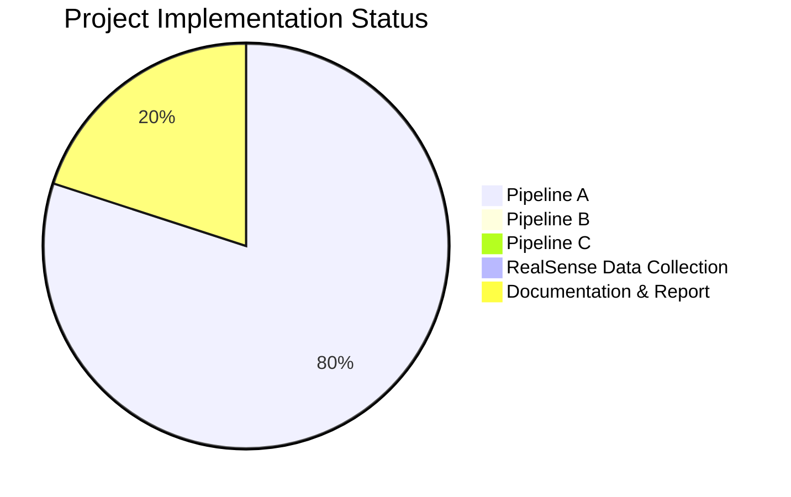

# Progress Tracking: Table Detection from 3D Point Clouds

## Overall Project Status

The project is in its early stages with focus primarily on Pipeline A implementation. Pipelines B and C have not yet been started. Documentation and setup are partially complete.

## Pipeline A: Depth to Point Cloud Classification

### What Works

- ✅ Basic project structure and organization
- ✅ Configuration system for managing parameters
- ✅ Point cloud generation from depth maps
- ✅ Dataset loading from MIT sequences
- ✅ Point cloud preprocessing and normalization
- ✅ Neural network architectures (DGCNN, PointNet)
- ✅ Basic training and evaluation scripts
- ✅ Visualization utilities for point clouds
- ✅ Initial model training implementation
- ✅ TensorBoard integration for tracking metrics
- ✅ Metric computation and visualization

### What Works (Continued)
- ✅ **New Dataset Split Strategy**: Implemented MIT sequences for training, Harvard sequences for validation (`dataset.py`, `train.py`).
- ✅ **Enhanced Regularization**: Implemented feature-level dropout in DGCNN (`classifier.py`), gradient clipping (`train.py`), and confirmed config parameters (`config.py`).
- ✅ **Advanced Data Augmentation**: Implemented point dropout and random subsampling (`preprocessing.py`) and confirmed config parameters (`config.py`).
- ✅ **Training Script Updates**: Aligned `train.py` with new dataset split, regularization, augmentation, and configuration loading.
- ✅ **Label Format Handling**: Confirmed existing logic in `dataset.py` handles `harvard_tea_2` format.
- ✅ **Depth Warning Resolution**: Identified cause of "No valid depth values" warning (low `max_depth` for `harvard_tea_2`) and fixed by increasing `max_depth` in `config.py`. Corrected related `IndentationError`.
- ✅ **Validation Data Shuffling**: Updated `dataset.py` to shuffle validation data (`shuffle=True`) as requested.

### In Progress

- 🔄 **Investigate Initial Validation Score**: Analyzing why the validation F1 score starts high (~0.83) and stays flat initially. Hypothesis: Model predicts majority class in imbalanced Harvard set.
    -   Calculating validation set class distribution.
    -   Reviewing evaluation logic (`evaluate.py`).
    -   Reviewing training loop (`train.py`).
    -   Reviewing model initialization (`classifier.py`).
- 🔄 **Prepare 'Augmentation Only' Run**: Preparing configuration (`config.py`) for the run (dropout=0.0, WD=0.0, clip=0.0, augment=True).

### Not Started

- ❌ Calculating exact validation set class distribution.
- ❌ Reviewing `evaluate.py`, `train.py`, `classifier.py` for initial score behavior.
- ❌ Running full training experiment with the 'augmentation only' configuration.
- ❌ Thorough evaluation and analysis of the 'augmentation only' results.
- ❌ Re-introducing mild regularization (e.g., small weight decay or dropout) if overfitting occurs in the 'augmentation only' run.
- ❌ Implementing mixup augmentation (if needed).
- ❌ Performance comparison with baseline/previous attempts.
- ❌ Integration of optimal model into final pipeline.
- ❌ Implementation of detailed train/validation divergence monitoring.

### Known Issues

- ✅ **Environment Instability**: Resolved (Confirmed by user as activation issue).
- 🐞 **Potential Overfitting**: The 'augmentation only' configuration (minimal regularization) might be prone to overfitting later in training. Needs monitoring.
- 🐞 **Initial F1 Score**: High starting F1 (~0.83) likely reflects model predicting the majority class in an imbalanced validation set. Investigation ongoing.
- 🐞 Handling of invalid depth values needs improvement (lower priority).
- 🐞 Point cloud sampling strategy ('random') may need optimization (lower priority).
- 🐞 Need to address missing table labels in some frames (lower priority).
- 🐞 Potential class imbalance in Harvard validation set (likely ~71.4% majority class based on initial metrics). Investigation ongoing.
- ℹ️ Validation data is now shuffled, which may slightly alter epoch-to-epoch scores compared to previous non-shuffled runs.

## Pipeline B: RGB to Depth to Classification

### Status: Not Started

Planned components:
- Monocular depth estimation model
- Depth classification model
- Training and evaluation framework

## Pipeline C: Depth to Point Cloud Segmentation

### Status: Not Started

Planned components:
- Point cloud processing for segmentation
- Segmentation model implementation
- Evaluation and visualization tools

## RealSense Data Collection

### Status: Not Started

Planned activities:
- Setup of RealSense camera
- Planning of capture environments
- Data collection sessions
- Data processing and organization

## Additional Tasks

### Documentation

- ✅ README with project overview
- ✅ Setup instructions
- ✅ Memory bank initialization
- 🔄 Memory bank updates for current challenges
- ❌ Report draft

### Experiment Tracking

- ✅ Setting up experiment tracking with TensorBoard
- ✅ Initial metric visualization
- 🔄 Enhanced monitoring for overfitting
- ❌ Creating additional visualization scripts

## Key Decision Evolution

### Dataset Split Strategy

Initial approach: Use MIT sequences for training with random 80/20 split for validation, and Harvard sequences for testing.

Previous issue: Validation data was too similar to training data, not providing a strong generalization signal.

Current strategy:
- Using MIT sequences (~290 frames) for training (larger dataset)
- Using Harvard sequences (~98 frames) for validation (smaller dataset)
- Test dataset to remain empty for now
- This approach provides a much stronger test of generalization
- Uses the larger dataset for training while ensuring validation tests generalization to a different data distribution

### Model Architecture

Initial decision: Use DGCNN as primary architecture due to its strong performance on point cloud tasks.

Previous evaluation: DGCNN shows strong capacity to learn training data but may be prone to overfitting.

Current direction:
- Confirmed that DGCNN's high capacity is contributing to overfitting with our limited dataset
- Implementing stronger regularization (dropout 0.5 → 0.7, weight decay 1e-4 → 5e-4)
- Adding feature-level dropout (0.2) to prevent co-adaptation
- Planning to test reduced embedding dimensions (1024 → 512)
- Will compare against PointNet for generalization performance

### Regularization Strategy

Initial approach: Standard dropout (0.5) and normalization techniques (GroupNorm, LayerNorm).

Previous direction: Exploring more aggressive regularization.

Current implementation:
- Increased dropout to 0.7 in the configuration
- Added feature-level dropout concept (0.2)
- Increased weight decay to 5e-4
- Added gradient clipping parameter (1.0)
- Enhanced data augmentation (wider rotation ranges, increased jitter, point dropout)

### Training Strategy

Initial approach: Standard training with early stopping based on validation F1-score.

Previous direction: Enhanced monitoring, aggressive regularization/augmentation to combat overfitting, leading to flat validation metrics.

Diagnosis Result: High dropout rates (`0.7` standard, `0.2` feature) were identified as the cause of flat validation metrics.

Current Strategy:
- Dataset Split: MIT (train), Harvard (validation).
- **Priority:** Investigate the high initial validation F1 score (imbalance hypothesis).
- Configuration (Post-Investigation): Use 'augmentation only' settings identified in diagnostics (Augmentation=True, Dropout=0.0, WD=0.0, Clip=0.0).
- **Next Steps:** Calculate validation distribution, review relevant code (`evaluate.py`, `train.py`, `classifier.py`), then run the 'augmentation only' config, analyze results (especially for overfitting), and potentially reintroduce mild regularization if needed.

## Milestones and Timeline

| Milestone | Target Date | Status |
|-----------|-------------|--------|
| Pipeline A implementation | TBD | 75% Complete |
| Address overfitting in Pipeline A | TBD | Implemented anti-overfitting measures |
| Diagnose Flat Validation Metrics | TBD | **Complete** |
| Identify Optimal Diagnostic Configuration | TBD | **Complete** ('Augmentation Only') |
| Resolve Environment Issues | TBD | **Complete** |
| Investigate Initial High Validation Score | TBD | **In Progress** |
| Train and Evaluate 'Augmentation Only' Config | TBD | **Pending** (Blocked by Investigation) |
| Achieve Improved Validation Performance | TBD | Pending Training Run |
| Pipeline B implementation | TBD | Not Started |
| Pipeline C implementation | TBD | Not Started |
| RealSense data collection | TBD | Not Started |
| Report draft | TBD | Not Started |
| Final submission | TBD | Not Started |
