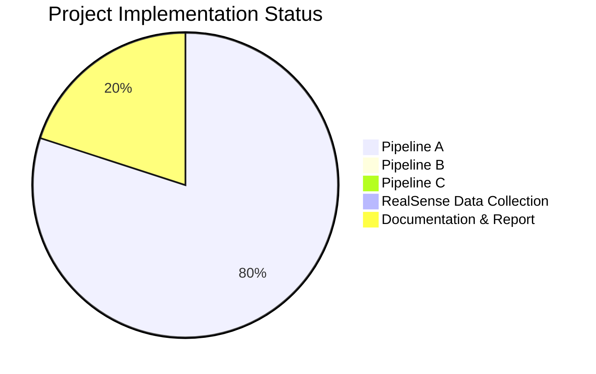

# Progress Tracking: Table Detection from 3D Point Clouds

## Overall Project Status

The project is in its early stages with focus primarily on Pipeline A implementation. Pipelines B and C have not yet been started. Documentation and setup are partially complete.

## Pipeline A: Depth to Point Cloud Classification

### What Works

- ✅ Basic project structure and organization
- ✅ Configuration system for managing parameters
- ✅ Point cloud generation from depth maps
- ✅ Dataset loading from MIT sequences
- ✅ Point cloud preprocessing and normalization
- ✅ Neural network architectures (DGCNN, PointNet)
- ✅ Basic training and evaluation scripts
- ✅ Visualization utilities for point clouds
- ✅ Initial model training implementation
- ✅ TensorBoard integration for tracking metrics
- ✅ Metric computation and visualization

### What Works (Continued)
- ✅ **Stratified Data Split Implementation**:
    - ✅ Extracted labels for Harvard frames (`scripts/extract_harvard_labels.py`).
    - ✅ Performed stratified 48/50 split for validation/test sets (`scripts/split_harvard_data.py`).
    - ✅ Updated `config.py` to load validation/test frame lists from pickle files.
    - ✅ Updated `dataset.py` (`TableDataset`, `create_data_loaders`) to handle loading based on frame lists for validation/test.
- ✅ **Enhanced Regularization**: Implemented feature-level dropout, gradient clipping (though currently disabled in config).
- ✅ **Advanced Data Augmentation**: Implemented point dropout, random subsampling (currently enabled in config).
- ✅ **Label Format Handling**: Confirmed logic handles `harvard_tea_2` raw depth format.
- ✅ **Depth Warning Resolution**: Resolved `max_depth` issue for `harvard_tea_2`.
- ✅ **Validation Data Shuffling**: `val_loader` uses `shuffle=True`.
- ✅ **Evaluation Script Alignment**: `evaluate.py` now correctly instantiates models using parameters (`emb_dims`, `feature_dropout`) from `config.py`, ensuring consistency with `train.py`.
- ✅ **Run Baseline Training**: Completed initial run with DGCNN, Augmentation=True, Dropout=0, WD=0.

### In Progress

- 🔄 **Evaluate Baseline on Test Set**: Running the *aligned* `evaluate.py` on the held-out test set (Harvard-Subset2, Test Set 1).

### Not Started

- ✅ **Verify Data Loaders**: Confirmed `create_data_loaders` loads correct sample counts (Train: 281, Val: 48, Test: 50).
- ❌ **Analyze Baseline Results**: Review performance, overfitting, etc., after evaluation.
- ❌ **Plan Further Experiments**: Decide next steps for Pipeline A or other pipelines based on baseline results.
- ❌ **Pipeline B Implementation**
- ❌ **Pipeline C Implementation**
- ❌ **RealSense Data Collection & Evaluation**
- ❌ **Report Writing**

### Known Issues

- ✅ **Environment Instability**: Resolved.
- ✅ **Initial F1 Score Investigation**: No longer relevant with the new split strategy.
- 🐞 **Potential Overfitting**: Baseline run needed to assess overfitting with the new split, as the current config uses minimal regularization (dropout=0, WD=0).
- ℹ️ **Dataset Notes**:
    - Negative Samples: `mit_gym_z_squash`, `harvard_tea_2`.
    - Missing Labels: Specific frames noted in `CW2.pdf` (handled by current logic).
    - Depth Format: `harvard_tea_2` uses raw depth.
- 🐞 Handling of invalid depth values during point cloud generation could be more robust (lower priority).
- 🐞 Point cloud sampling strategy ('random') might need optimization (lower priority).

## Pipeline B: RGB to Depth to Classification

### Status: Not Started

Planned components:
- Monocular depth estimation model
- Depth classification model
- Training and evaluation framework

## Pipeline C: Depth to Point Cloud Segmentation

### Status: Not Started

Planned components:
- Point cloud processing for segmentation
- Segmentation model implementation
- Evaluation and visualization tools

## RealSense Data Collection

### Status: Not Started

Planned activities:
- Setup of RealSense camera
- Planning of capture environments
- Data collection sessions
- Data processing and organization

## Additional Tasks

### Documentation

- ✅ README with project overview
- ✅ Setup instructions
- ✅ Memory bank initialization
- ✅ Memory bank updates (Reflecting data split and evaluate.py alignment)
- ❌ Report draft

### Experiment Tracking

- ✅ Setting up experiment tracking with TensorBoard
- ✅ Initial metric visualization
- 🔄 Enhanced monitoring for overfitting
- ❌ Creating additional visualization scripts

## Key Decision Evolution

### Dataset Split Strategy

Initial approach: MIT sequences for training, random 80/20 split within MIT for validation, Harvard for testing. *Issue: Weak validation signal.*

Intermediate approach: MIT for training, full Harvard set for validation. *Issue: Test set not unseen, potentially inflated validation metrics.*

Current strategy (Implemented):
- **Training**: MIT sequences (290 frames).
- **Validation**: Stratified random subset of Harvard sequences (48 frames).
- **Test Set 1**: Remaining stratified random subset of Harvard sequences (50 frames).
- **Rationale**: Provides validation data for monitoring/tuning during training while preserving a truly unseen test set (Test Set 1) for final evaluation. Addresses methodological concerns and aligns better with standard practices.

### Model Architecture

Initial decision: Use DGCNN as primary architecture due to its strong performance on point cloud tasks.

Previous evaluation: DGCNN shows strong capacity to learn training data but may be prone to overfitting.

Current direction:
- DGCNN selected as initial architecture.
- Baseline run will use minimal regularization to establish performance.
- Based on baseline results, previously explored aggressive regularization techniques (dropout 0.7, WD 5e-4, feature dropout 0.2, gradient clipping) may be reintroduced or tuned if overfitting is observed.
- Reduced embedding dimensions (1024 -> 512) and comparison with PointNet remain options for future experiments if needed.

### Regularization Strategy

Initial approach: Standard dropout (0.5) and normalization.

Previous direction: Explored more aggressive regularization techniques.

Current Strategy:
- Baseline run will use minimal regularization (dropout=0, WD=0, clipping=0) but keep augmentation enabled.
- If baseline shows overfitting on the new validation set, the previously implemented techniques (increased dropout, feature dropout, increased weight decay, gradient clipping, enhanced augmentation) will be selectively re-enabled and tuned.

### Training Strategy

Initial approach: Standard training with early stopping based on validation F1.

Previous direction: Focused on diagnosing flat validation metrics caused by high dropout when using the full Harvard set for validation.

Current Strategy:
- **Dataset Split**: Using the new MIT=Train, Harvard-Subset1=Val, Harvard-Subset2=Test split.
- **Configuration**: Baseline run will use config with Augmentation=True, Dropout=0.0, WD=0.0, Clip=0.0.
- **Next Steps**: Verify data loaders, run baseline training, evaluate on the test set (Harvard-Subset2), analyze results. Based on analysis, decide on further tuning (e.g., reintroducing regularization if overfitting occurs). Early stopping based on the new validation set (Harvard-Subset1) performance will be used.

## Milestones and Timeline

| Milestone | Target Date | Status |
|-----------|-------------|--------|
| Implement Stratified Val/Test Split | TBD | **Complete** |
| Update Memory Bank for New Split | TBD | **Complete** |
| Verify Data Loaders | TBD | **Complete** |
| Align `evaluate.py` Model Instantiation | TBD | **Complete** |
| Update Memory Bank (Post-Alignment) | TBD | **Complete** |
| Run Baseline Training (Pipeline A) | TBD | **Complete** |
| Evaluate Baseline on Test Set (Pipeline A) | TBD | **In Progress** |
| Analyze Baseline Results (Pipeline A) | TBD | Pending |
| Pipeline B implementation | TBD | Not Started |
| Pipeline C implementation | TBD | Not Started |
| RealSense data collection & Eval | TBD | Not Started |
| Report draft | TBD | Not Started |
| Final submission | TBD | Not Started |
