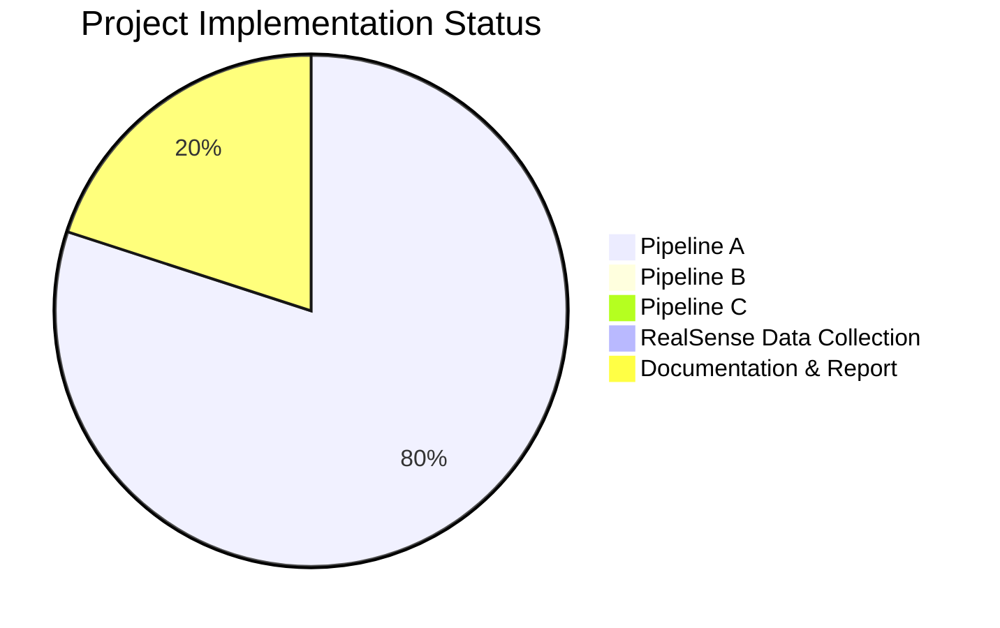

# Progress Tracking: Table Detection from 3D Point Clouds

## Overall Project Status

The project is in its early stages with focus primarily on Pipeline A implementation. Pipelines B and C have not yet been started. Documentation and setup are partially complete.

## Pipeline A: Depth to Point Cloud Classification

### What Works

- ✅ Basic project structure and organization
- ✅ Configuration system for managing parameters
- ✅ Point cloud generation from depth maps
- ✅ Dataset loading from MIT sequences
- ✅ Point cloud preprocessing and normalization
- ✅ Neural network architectures (DGCNN, PointNet)
- ✅ Basic training and evaluation scripts
- ✅ Visualization utilities for point clouds
- ✅ Initial model training implementation
- ✅ TensorBoard integration for tracking metrics
- ✅ Metric computation and visualization

### In Progress

- 🔄 Addressing model overfitting issues
  - ✅ Identified root causes: model capacity vs. dataset size and train/val split methodology
  - ✅ Updated configuration parameters with stronger regularization and augmentation
  - 🔄 Implementing feature-level dropout and advanced regularization
- 🔄 Data augmentation enhancement for point clouds
  - ✅ Increased rotation range, jitter, and scale variation
  - 🔄 Implementing point dropout and random subsampling
- 🔄 Improving generalization performance
  - 🔄 Designing sequence-based validation strategy
  - 🔄 Adding train/validation divergence monitoring
- 🔄 Balancing model complexity with dataset size
  - 🔄 Testing reduced embedding dimensions
  - 🔄 Comparing DGCNN and PointNet generalization
- 🔄 Hyperparameter optimization

### Not Started

- ❌ Thorough evaluation on Harvard test data
- ❌ Performance analysis and comparison with baseline
- ❌ Integration of optimal model into final pipeline

### Known Issues

- 🐞 **Current Focus**: Training metrics (accuracy, F1-score) increase while validation metrics stagnate, indicating overfitting
  - 🔍 Root cause identified: Model capacity too high for dataset size + non-optimal validation split
  - 🛠️ Solution in progress: Enhanced regularization, improved validation strategy
- 🐞 Train/validation split strategy using random frame-level split from same MIT sequences may not properly test generalization
- 🐞 Handling of invalid depth values needs improvement
- 🐞 Point cloud sampling strategy may need optimization
- 🐞 Need to address missing table labels in some frames
- 🐞 Potential class imbalance in training/validation splits

## Pipeline B: RGB to Depth to Classification

### Status: Not Started

Planned components:
- Monocular depth estimation model
- Depth classification model
- Training and evaluation framework

## Pipeline C: Depth to Point Cloud Segmentation

### Status: Not Started

Planned components:
- Point cloud processing for segmentation
- Segmentation model implementation
- Evaluation and visualization tools

## RealSense Data Collection

### Status: Not Started

Planned activities:
- Setup of RealSense camera
- Planning of capture environments
- Data collection sessions
- Data processing and organization

## Additional Tasks

### Documentation

- ✅ README with project overview
- ✅ Setup instructions
- ✅ Memory bank initialization
- 🔄 Memory bank updates for current challenges
- ❌ Report draft

### Experiment Tracking

- ✅ Setting up experiment tracking with TensorBoard
- ✅ Initial metric visualization
- 🔄 Enhanced monitoring for overfitting
- ❌ Creating additional visualization scripts

## Key Decision Evolution

### Model Architecture

Initial decision: Use DGCNN as primary architecture due to its strong performance on point cloud tasks.

Previous evaluation: DGCNN shows strong capacity to learn training data but may be prone to overfitting.

Current direction:
- Confirmed that DGCNN's high capacity is contributing to overfitting with our limited dataset
- Implementing stronger regularization (dropout 0.5 → 0.7, weight decay 1e-4 → 5e-4)
- Adding feature-level dropout (0.2) to prevent co-adaptation
- Planning to test reduced embedding dimensions (1024 → 512)
- Will compare against PointNet for generalization performance

### Regularization Strategy

Initial approach: Standard dropout (0.5) and normalization techniques (GroupNorm, LayerNorm).

Previous direction: Exploring more aggressive regularization.

Current implementation:
- Increased dropout to 0.7 in the configuration
- Added feature-level dropout concept (0.2)
- Increased weight decay to 5e-4
- Added gradient clipping parameter (1.0)
- Enhanced data augmentation (wider rotation ranges, increased jitter, point dropout)

### Training Strategy

Initial approach: Standard training with early stopping based on validation F1-score.

Previous direction: Enhanced monitoring of training/validation divergence.

Current implementation:
- Added gradient clipping to prevent extreme weight updates
- Added mixup parameter for implementation
- Planning to implement train/validation divergence metric for early warning
- Identified need for sequence-based validation split instead of random frame-based

## Milestones and Timeline

| Milestone | Target Date | Status |
|-----------|-------------|--------|
| Pipeline A implementation | TBD | 65% Complete |
| Address overfitting in Pipeline A | TBD | In Progress (~40% Complete) |
| Pipeline B implementation | TBD | Not Started |
| Pipeline C implementation | TBD | Not Started |
| RealSense data collection | TBD | Not Started |
| Report draft | TBD | Not Started |
| Final submission | TBD | Not Started |
