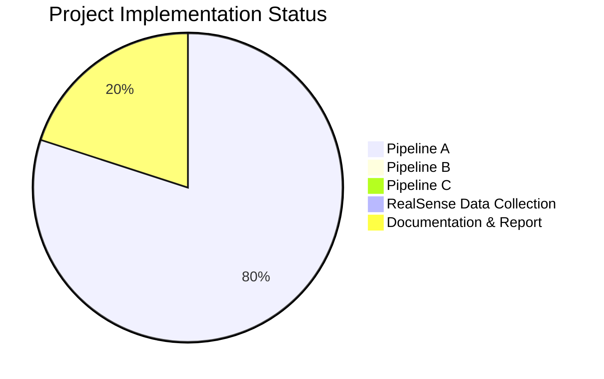

# Progress Tracking: Table Detection from 3D Point Clouds

## Overall Project Status

The project is in its early stages with focus primarily on Pipeline A implementation. Pipelines B and C have not yet been started. Documentation and setup are partially complete.

## Pipeline A: Depth to Point Cloud Classification

### What Works

- ✅ Basic project structure and organization
- ✅ Configuration system for managing parameters
- ✅ Point cloud generation from depth maps
- ✅ Dataset loading from MIT sequences
- ✅ Point cloud preprocessing and normalization
- ✅ Neural network architectures (DGCNN, PointNet)
- ✅ Basic training and evaluation scripts
- ✅ Visualization utilities for point clouds
- ✅ Initial model training implementation
- ✅ TensorBoard integration for tracking metrics
- ✅ Metric computation and visualization

### What Works (Continued)
- ✅ **Stratified Data Split Implementation**:
    - ✅ Extracted labels for Harvard frames (`scripts/extract_harvard_labels.py`).
    - ✅ Performed stratified 48/50 split for validation/test sets (`scripts/split_harvard_data.py`).
    - ✅ Updated `config.py` to load validation/test frame lists from pickle files.
    - ✅ Updated `dataset.py` (`TableDataset`, `create_data_loaders`) to handle loading based on frame lists for validation/test.
- ✅ **Enhanced Regularization**: Implemented feature-level dropout, gradient clipping (though currently disabled in config).
- ✅ **Advanced Data Augmentation**: Implemented point dropout, random subsampling (currently enabled in config).
- ✅ **Label Format Handling**: Confirmed logic handles `harvard_tea_2` raw depth format.
- ✅ **Depth Warning Resolution**: Resolved `max_depth` issue for `harvard_tea_2`.
- ✅ **Validation Data Shuffling**: `val_loader` uses `shuffle=True`.
- ✅ **Evaluation Script Alignment**: `evaluate.py` now correctly instantiates models using parameters (`emb_dims`, `feature_dropout`) from `config.py`, ensuring consistency with `train.py`.
- ✅ **Run Baseline Training**: Completed initial run with DGCNN, Augmentation=True, Dropout=0, WD=0.

### What Works (Continued)
- ✅ **Evaluate Baseline on Test Set**: Completed evaluation on Test Set 1 (Harvard-Subset2).
    - **Results**: Acc: 0.7400, Precision: 0.9259, Recall: 0.6944, F1: 0.7937, AUC: 0.8175.
    - **Observation**: Drop from validation accuracy (0.8542) indicates significant overfitting (Val-Test Gap: 0.1142).
- ✅ **Analyze Baseline Results**: Completed. Confirmed overfitting.
- ✅ **Plan Regularization Experiments**: Decided to start with `dropout=0.5` (Exp 1), then add `weight_decay=1e-4` (Exp 2).
- ✅ **Run Experiment 1 (Dropout=0.5)**: Completed training run `dgcnn_20250405_145031`.
    - **Best Validation Results (Epoch 45)**: Acc: 0.9375, F1: 0.9552.
- ✅ **Evaluate Experiment 1 on Test Set**: Completed evaluation on Test Set 1.
    - **Results**: Acc: 0.8000, Precision: 0.9062, Recall: 0.8056, F1: 0.8529, AUC: 0.8214.
    - **Observation**: Significant improvement over baseline, but Val-Test Gap slightly increased (0.1375). Overfitting persists. **Best result so far.**
- ✅ **Prepare for Experiment 2 (Dropout=0.5, WD=1e-4)**: Completed (Modified config file).
- ✅ **Run Experiment 2 (Dropout=0.5, WD=1e-4)**: Completed training run `dgcnn_20250405_150122`.
    - **Best Validation Results (Epoch 20)**: Acc: 0.8958, F1: 0.9254.
- ✅ **Evaluate Experiment 2 on Test Set**: Completed evaluation on Test Set 1.
    - **Results**: Acc: 0.7600, Precision: 0.8750, Recall: 0.7778, F1: 0.8235, AUC: 0.8452.
    - **Observation**: Performance *decreased* compared to Exp 1. Val-Test Gap remained similar (0.1358).
- ✅ **Analyze Experiment 2 Results**: Completed. Adding WD=1e-4 was detrimental.
- ✅ **Prepare for Experiment 3 (Dropout=0.5, FeatureDropout=0.2)**: Completed (Modified config file).
- ✅ **Run Experiment 3 (Dropout=0.5, FeatureDropout=0.2)**: Completed training run `dgcnn_20250405_152052`.
    - **Best Validation Results (Epoch 1)**: Acc: 0.7083, F1: 0.8293.
- ✅ **Evaluate Experiment 3 on Test Set**: Completed evaluation on Test Set 1.
    - **Results**: Acc: 0.7200, Precision: 0.7200, Recall: 1.0000, F1: 0.8372, AUC: 0.5179.
    - **Observation**: Performance significantly degraded. Model learned poorly (AUC ~0.5), likely due to excessive regularization.
- ✅ **Analyze Experiment 3 Results**: Completed. Adding FD=0.2 on top of D=0.5 was highly detrimental.
- ✅ **Prepare for Experiment 4 (Dropout=0.3)**: Completed (Modified config file).
- ✅ **Run Experiment 4 (Dropout=0.3)**: Completed training run `dgcnn_20250405_152915`.
    - **Best Validation Results (Epoch 37)**: Acc: 0.9167, F1: 0.9167.
- ✅ **Evaluate Experiment 4 on Test Set**: Completed evaluation on Test Set 1.
    - **Results**: Acc: 0.7800, Precision: 0.8205, Recall: 0.8889, F1: 0.8533, AUC: 0.8313.
    - **Observation**: Performance slightly worse than Exp 1 (D=0.5). Val-Test Gap remained similar (0.1367).
- ✅ **Analyze Experiment 4 Results**: Completed. D=0.3 is slightly less effective than D=0.5.
- ✅ **Conclude Initial Regularization Tuning**: Experiment 1 (D=0.5 only) is the best configuration found so far.

### In Progress

- 🔄 **Prepare for Next Phase**: Reverting config to best settings (D=0.5) and planning next steps (Pipeline B/C or other Pipeline A improvements).

### Not Started

- ✅ **Verify Data Loaders**: Confirmed `create_data_loaders` loads correct sample counts (Train: 281, Val: 48, Test: 50).
- ❌ **Pipeline B Implementation**
- ❌ **Pipeline C Implementation**
- ❌ **RealSense Data Collection & Evaluation**
- ❌ **Report Writing**

### Known Issues

- ✅ **Environment Instability**: Resolved.
- ✅ **Initial F1 Score Investigation**: No longer relevant with the new split strategy.
- 🐞 **Confirmed Overfitting**: Baseline (Val 0.85 vs Test 0.74). Exp 1 (D=0.5) improved (Val 0.94 vs Test 0.80) but gap persisted (~0.14). Exp 2 (WD=1e-4) worsened. Exp 3 (FD=0.2) severely degraded. Exp 4 (D=0.3) slightly worse than Exp 1. Overfitting remains an issue, but further tuning of D/WD/FD seems unproductive.
- ℹ️ **Dataset Notes**:
    - Negative Samples: `mit_gym_z_squash`, `harvard_tea_2`.
    - Missing Labels: Specific frames noted in `CW2.pdf` (handled by current logic).
    - Depth Format: `harvard_tea_2` uses raw depth.
- 🐞 Handling of invalid depth values during point cloud generation could be more robust (lower priority).
- 🐞 Point cloud sampling strategy ('random') might need optimization (lower priority).

## Pipeline B: RGB to Depth to Classification

### Status: Not Started

Planned components:
- Monocular depth estimation model
- Depth classification model
- Training and evaluation framework

## Pipeline C: Depth to Point Cloud Segmentation

### Status: Not Started

Planned components:
- Point cloud processing for segmentation
- Segmentation model implementation
- Evaluation and visualization tools

## RealSense Data Collection

### Status: Not Started

Planned activities:
- Setup of RealSense camera
- Planning of capture environments
- Data collection sessions
- Data processing and organization

## Additional Tasks

### Documentation

- ✅ README with project overview
- ✅ Setup instructions
- ✅ Memory bank initialization
- ✅ Memory bank updates (Reflecting data split and evaluate.py alignment)
- ❌ Report draft

### Experiment Tracking

- ✅ Setting up experiment tracking with TensorBoard
- ✅ Initial metric visualization
- 🔄 Enhanced monitoring for overfitting
- ❌ Creating additional visualization scripts

## Key Decision Evolution

### Dataset Split Strategy

Initial approach: MIT sequences for training, random 80/20 split within MIT for validation, Harvard for testing. *Issue: Weak validation signal.*

Intermediate approach: MIT for training, full Harvard set for validation. *Issue: Test set not unseen, potentially inflated validation metrics.*

Current strategy (Implemented):
- **Training**: MIT sequences (290 frames).
- **Validation**: Stratified random subset of Harvard sequences (48 frames).
- **Test Set 1**: Remaining stratified random subset of Harvard sequences (50 frames).
- **Rationale**: Provides validation data for monitoring/tuning during training while preserving a truly unseen test set (Test Set 1) for final evaluation. Addresses methodological concerns and aligns better with standard practices.

### Model Architecture

Initial decision: Use DGCNN as primary architecture due to its strong performance on point cloud tasks.

Previous evaluation: DGCNN shows strong capacity to learn training data but may be prone to overfitting.

Current direction:
- DGCNN selected as initial architecture.
- Baseline run will use minimal regularization to establish performance.
- Based on baseline results, previously explored aggressive regularization techniques (dropout 0.7, WD 5e-4, feature dropout 0.2, gradient clipping) may be reintroduced or tuned if overfitting is observed.
- Reduced embedding dimensions (1024 -> 512) and comparison with PointNet remain options for future experiments if needed.

### Regularization Strategy

Initial approach: Standard dropout (0.5) and normalization.

Previous direction: Explored more aggressive regularization techniques.

Current Strategy:
- Baseline (D=0, WD=0): Overfitting confirmed (Val 0.85 vs Test 0.74).
- Exp 1 (D=0.5, WD=0): Improved performance (Val 0.94, Test 0.80), gap persisted (0.14). **Best so far.**
- Exp 2 (D=0.5, WD=1e-4): Worsened test performance (Test 0.76).
- Exp 3 (D=0.5, FD=0.2): Severely degraded performance (Test 0.72, AUC ~0.5).
- Exp 4 (D=0.3, WD=0, FD=0): Slightly worse than Exp 1 (Test 0.78).
- **Conclusion**: Initial regularization tuning complete. Exp 1 (D=0.5 only) is the best configuration. Revert config to D=0.5.

### Training Strategy

Initial approach: Standard training with early stopping based on validation F1.

Previous direction: Focused on diagnosing flat validation metrics caused by high dropout when using the full Harvard set for validation.

Current Strategy:
- **Dataset Split**: Using the new MIT=Train, Harvard-Subset1=Val, Harvard-Subset2=Test split.
- **Configuration (Baseline)**: Augmentation=True, Dropout=0.0, WD=0.0, Clip=0.0.
- **Evaluation (Baseline)**: Test Set 1 Acc: 0.7400 (Val Acc: 0.8542). Overfitting confirmed.
- **Configuration (Exp 1)**: Aug=True, D=0.5, WD=0.0, Clip=0.0.
- **Evaluation (Exp 1)**: Test Acc: 0.8000 (Val Acc: 0.9375). Improved, gap persisted. **Best so far.**
- **Configuration (Exp 2)**: Aug=True, D=0.5, WD=1e-4, Clip=0.0.
- **Evaluation (Exp 2)**: Test Acc: 0.7600 (Val Acc: 0.8958). Performance decreased.
- **Configuration (Exp 3)**: Aug=True, D=0.5, WD=0.0, FD=0.2, Clip=0.0.
- **Evaluation (Exp 3)**: Test Acc: 0.7200 (Val Acc: 0.7083). Performance severely degraded.
- **Configuration (Exp 4)**: Aug=True, D=0.3, WD=0.0, FD=0.0, Clip=0.0.
- **Evaluation (Exp 4)**: Test Acc: 0.7800 (Val Acc: 0.9167). Slightly worse than Exp 1.
- **Next Steps**: Revert config to Exp 1 settings (D=0.5). Plan next major phase (Pipeline B/C or other Pipeline A improvements). Continue using early stopping based on validation set performance.

## Milestones and Timeline

| Milestone | Target Date | Status |
|-----------|-------------|--------|
| Implement Stratified Val/Test Split | TBD | **Complete** |
| Update Memory Bank for New Split | TBD | **Complete** |
| Verify Data Loaders | TBD | **Complete** |
| Align `evaluate.py` Model Instantiation | TBD | **Complete** |
| Update Memory Bank (Post-Alignment) | TBD | **Complete** |
| Run Baseline Training (Pipeline A) | TBD | **Complete** |
| Evaluate Baseline on Test Set (Pipeline A) | TBD | **Complete** |
| Analyze Baseline Results (Pipeline A) | TBD | **Complete** |
| Plan Regularization Experiments (Pipeline A) | TBD | **Complete** |
| Run Experiment 1 (Dropout=0.5) | TBD | **Complete** |
| Evaluate Experiment 1 | TBD | **Complete** |
| Update Memory Bank (Post-Exp 1) | TBD | **Complete** |
| Prepare Experiment 2 (Dropout=0.5, WD=1e-4) | TBD | **Complete** |
| Run Experiment 2 | TBD | **Complete** |
| Evaluate Experiment 2 | TBD | **Complete** |
| Analyze Experiment 2 Results | TBD | **Complete** |
| Update Memory Bank (Post-Exp 2) | TBD | **Complete** |
| Prepare Experiment 3 (D=0.5, FD=0.2) | TBD | **Complete** |
| Run Experiment 3 | TBD | **Complete** |
| Evaluate Experiment 3 | TBD | **Complete** |
| Analyze Experiment 3 Results | TBD | **Complete** |
| Update Memory Bank (Post-Exp 3) | TBD | **Complete** |
| Prepare Experiment 4 (D=0.3) | TBD | **Complete** |
| Run Experiment 4 | TBD | **Complete** |
| Evaluate Experiment 4 | TBD | **Complete** |
| Analyze Experiment 4 Results | TBD | **Complete** |
| Update Memory Bank (Post-Exp 4) | TBD | **Complete** |
| Prepare for Next Phase | TBD | **In Progress** |
| Pipeline B implementation | TBD | Not Started |
| Pipeline C implementation | TBD | Not Started |
| RealSense data collection & Eval | TBD | Not Started |
| Report draft | TBD | Not Started |
| Final submission | TBD | Not Started |
