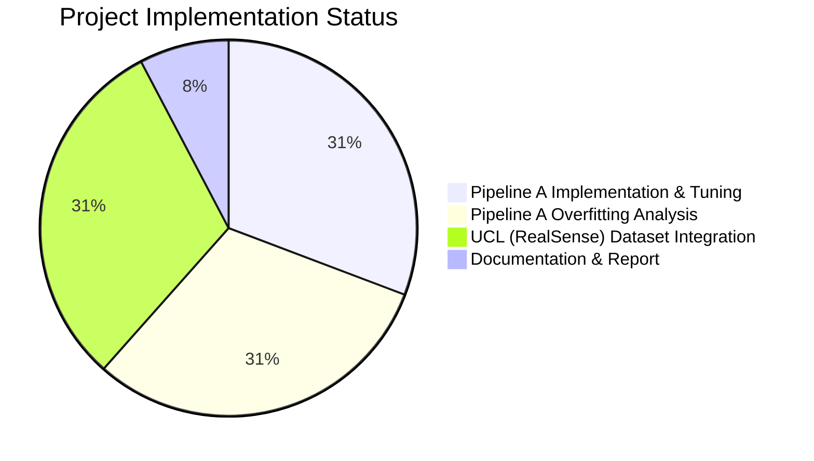

# Progress Tracking: Table Detection from 3D Point Clouds

## Overall Project Status

*(Scope revised to focus solely on Pipeline A)*

The project focuses solely on Pipeline A. Implementation, tuning, analysis, and final model selection are complete. Dataset integration is complete. Documentation is partially complete.

## Pipeline A: Depth to Point Cloud Classification

### What Works

- ✅ Basic project structure and organization
- ✅ Configuration system for managing parameters
- ✅ Point cloud generation from depth maps
- ✅ Dataset loading from MIT sequences
- ✅ Point cloud preprocessing and normalization
- ✅ Neural network architectures (DGCNN, PointNet)
- ✅ Basic training and evaluation scripts
- ✅ Visualization utilities for point clouds
- ✅ Initial model training implementation
- ✅ TensorBoard integration for tracking metrics
- ✅ Metric computation and visualization

### What Works (Continued)
- ✅ **Stratified Data Split Implementation**:
    - ✅ Extracted labels for Harvard frames (`scripts/extract_harvard_labels.py`).
    - ✅ Performed stratified 48/50 split for validation/test sets (`scripts/split_harvard_data.py`).
    - ✅ Updated `config.py` to load validation/test frame lists from pickle files.
    - ✅ Updated `dataset.py` (`TableDataset`, `create_data_loaders`) to handle loading based on frame lists for validation/test.
- ✅ **Enhanced Regularization**: Implemented feature-level dropout, gradient clipping (though currently disabled in config).
- ✅ **Advanced Data Augmentation**: Implemented point dropout, random subsampling (currently enabled in config).
- ✅ **Label Format Handling**: Confirmed logic handles `harvard_tea_2` raw depth format.
- ✅ **Depth Warning Resolution**: Resolved `max_depth` issue for `harvard_tea_2`.
- ✅ **Validation Data Shuffling**: `val_loader` uses `shuffle=True`.
- ✅ **Evaluation Script Alignment**: `evaluate.py` now correctly instantiates models using parameters (`emb_dims`, `feature_dropout`) from `config.py`, ensuring consistency with `train.py`.
- ✅ **Run Baseline Training**: Completed initial run with DGCNN, Augmentation=True, Dropout=0, WD=0.

### What Works (Continued)
- ✅ **Evaluate Baseline on Test Set**: Completed evaluation on Test Set 1 (Harvard-Subset2).
    - **Results**: Acc: 0.7400, Precision: 0.9259, Recall: 0.6944, F1: 0.7937, AUC: 0.8175.
    - **Observation**: Drop from validation accuracy (0.8542) indicates significant overfitting (Val-Test Gap: 0.1142).
- ✅ **Analyze Baseline Results**: Completed. Confirmed overfitting.
- ✅ **Plan Regularization Experiments**: Decided to start with `dropout=0.5` (Exp 1), then add `weight_decay=1e-4` (Exp 2).
cl- ✅ **Run Experiment 1 (Dropout=0.5)**: Completed training run `dgcnn_20250405_145031`.
    - **Best Validation Results (Epoch 45)**: Acc: 0.9375, F1: 0.9552.
- ✅ **Evaluate Experiment 1 on Test Set**: Completed evaluation on Test Set 1.
    - **Results**: Acc: 0.8000, Precision: 0.9062, Recall: 0.8056, F1: 0.8529, AUC: 0.8214.
    - **Observation**: Significant improvement over baseline, but Val-Test Gap slightly increased (0.1375). Overfitting persists. **Best result so far.**
- ✅ **Prepare for Experiment 2 (Dropout=0.5, WD=1e-4)**: Completed (Modified config file).
- ✅ **Run Experiment 2 (Dropout=0.5, WD=1e-4)**: Completed training run `dgcnn_20250405_150122`.
    - **Best Validation Results (Epoch 20)**: Acc: 0.8958, F1: 0.9254.
- ✅ **Evaluate Experiment 2 on Test Set**: Completed evaluation on Test Set 1.
    - **Results**: Acc: 0.7600, Precision: 0.8750, Recall: 0.7778, F1: 0.8235, AUC: 0.8452.
    - **Observation**: Performance *decreased* compared to Exp 1. Val-Test Gap remained similar (0.1358).
- ✅ **Analyze Experiment 2 Results**: Completed. Adding WD=1e-4 was detrimental.
- ✅ **Prepare for Experiment 3 (Dropout=0.5, FeatureDropout=0.2)**: Completed (Modified config file).
- ✅ **Run Experiment 3 (Dropout=0.5, FeatureDropout=0.2)**: Completed training run `dgcnn_20250405_152052`.
    - **Best Validation Results (Epoch 1)**: Acc: 0.7083, F1: 0.8293.
- ✅ **Evaluate Experiment 3 on Test Set**: Completed evaluation on Test Set 1.
    - **Results**: Acc: 0.7200, Precision: 0.7200, Recall: 1.0000, F1: 0.8372, AUC: 0.5179.
    - **Observation**: Performance significantly degraded. Model learned poorly (AUC ~0.5), likely due to excessive regularization.
- ✅ **Analyze Experiment 3 Results**: Completed. Adding FD=0.2 on top of D=0.5 was highly detrimental.
- ✅ **Prepare for Experiment 4 (Dropout=0.3)**: Completed (Modified config file).
- ✅ **Run Experiment 4 (Dropout=0.3)**: Completed training run `dgcnn_20250405_152915`.
    - **Best Validation Results (Epoch 37)**: Acc: 0.9167, F1: 0.9167.
- ✅ **Evaluate Experiment 4 on Test Set**: Completed evaluation on Test Set 1.
    - **Results**: Acc: 0.7800, Precision: 0.8205, Recall: 0.8889, F1: 0.8533, AUC: 0.8313.
    - **Observation**: Performance slightly worse than Exp 1 (D=0.5). Val-Test Gap remained similar (0.1367).
- ✅ **Analyze Experiment 4 Results**: Completed. D=0.3 is slightly less effective than D=0.5.
- ✅ **Prepare for Experiment 5 (PointNet, D=0.5)**: Completed (Modified config file).
- ✅ **Run Experiment 5 (PointNet, D=0.5)**: Completed training run `pointnet_20250405_155003`.
    - **Best Validation Results (Epoch 2)**: Acc: 0.7083, F1: 0.8293.
- ✅ **Evaluate Experiment 5 on Test Set**: Completed evaluation on Test Set 1.
    - **Results**: Acc: 0.7200, Precision: 0.7200, Recall: 1.0000, F1: 0.8372, AUC: 0.4226.
    - **Observation**: PointNet performed poorly, likely classifying almost everything as Table (AUC ~0.42).
- ✅ **Analyze Experiment 5 Results**: Completed. PointNet is not suitable with current setup.
- ✅ **Conclude Pipeline A Tuning**: Experiment 1 (DGCNN, D=0.5) remains the best configuration.
- ✅ **Create Test Result Visualization Script**: Created `src/pipelineA/visualize_test_predictions.py` to annotate RGB images with predictions.
- ✅ **Enable Custom Dataset ('ucl') Evaluation (as Test Set 2)**:
    - ✅ Added `UCL_DATA_CONFIG` to `config.py`.
    - ✅ Modified `dataset.py` to load 'ucl' data and text labels.
    - ✅ Modified `evaluate.py` and `visualize_test_predictions.py` to accept `EVAL_TEST_SET=2` for 'ucl'.
- ✅ **Enable Default Evaluation Run**:
    - ✅ Added `DEFAULT_EVAL_*` parameters to `config.py`.
    - ✅ Modified `evaluate.py` to use defaults if no CLI args are provided.
- ✅ **Centralize Configuration (Cleanup Task 1)**:
    - ✅ Removed CLI argument parsing from `train.py`, `evaluate.py`, `visualize_test_predictions.py`.
    - ✅ Updated scripts to source all parameters from `config.py`.
    - ✅ Added necessary general (`SEED`, `DEVICE`, etc.) and specific (`EVAL_*`, `VIS_*`) parameters to `config.py`.
- ✅ **Fix Visualization Script Config Usage**: Updated `visualize_test_predictions.py` to use `EVAL_CHECKPOINT` and `EVAL_TEST_SET` from `config.py`.
- ✅ **Verify Pipeline A Workflow**: Successfully executed `train.py` (briefly), `evaluate.py`, and `visualize_test_predictions.py` using the centralized configuration, confirming the workflow functions correctly after the cleanup.
- ✅ **Fix Visualization Image Matching**: Updated `dataset.py` to match depth/image files by frame number, then by sorted order if counts match. Resolved warnings for most sequences.
- ✅ **Investigate Remaining Visualization Warnings**: Confirmed remaining warnings for `harvard_tea_2` are due to dataset inconsistency (33 depth vs 24 image files), preventing order-based matching.
- ✅ **Consolidate Test Sets (Cleanup)**: Unified Test Set 2 (RealSense) and Test Set 3 (UCL) into a single Test Set 2 using `UCL_DATA_CONFIG`. Updated `config.py`, `evaluate.py`, `visualize_test_predictions.py`, and Memory Bank files.

### What Works (Continued)
- ✅ **Overfitting Analysis (Val vs Test1)**: Completed evaluation and visualization on both Validation Set (Harvard-Subset1) and Test Set 1 (Harvard-Subset2) using the best checkpoint (`dgcnn_20250407_142213/model_best.pt`). Results documented in `activeContext.md`.
- ✅ **Identify Domain Shift**: Identified DepthTSDF vs raw depth difference as likely cause of generalization gap.
- ✅ **Modify Training Set for Domain Adaptation**: Moved `harvard_tea_2` (raw depth) to training set in `config.py`.
- ✅ **Update Data Split Scripts**: Modified `extract_harvard_labels.py` to exclude `harvard_tea_2`; confirmed `split_harvard_data.py` handles variable input size.
- ✅ **Regenerate Data Splits**: Executed scripts to create new `harvard_frame_labels.pkl` (74 frames), `validation_frames.pkl` (24 frames), and `test_frames.pkl` (50 frames).
- ✅ **Run Training (Domain Adaptation Attempt)**: Completed training run `dgcnn_20250407_171414` using DGCNN, D=0.5 on the mixed training set (MIT + `harvard_tea_2`). Best validation F1: 0.9787 (Epoch 1).
- ✅ **Evaluate Domain Adaptation Model**: Completed evaluation on updated Test Set 1. Results (Acc: 0.94, F1: 0.97, Recall: 1.0, AUC: 0.26) indicated prediction bias.
- ✅ **Analyze Domain Adaptation Results**: Concluded attempt failed due to prediction bias.
- ✅ **Investigate Training Set Class Balance**: Created and ran script `analyze_training_set_balance.py`. Confirmed mixed training set (MIT + `harvard_tea_2`) was well-balanced (47.5% / 52.5%). Ruled out class imbalance as cause for domain adaptation failure.
- ✅ **Final Decision**: Reverted to original data split (MIT=Train, Harvard=Val/Test pool).
- ✅ **Restore Project State**: Reverted config and regenerated original data split files (`validation_frames.pkl`, `test_frames.pkl`).
- ✅ **Re-run Training (Exp 1)**: Completed re-run `dgcnn_20250407_174719` using DGCNN, D=0.5 on MIT only. Best validation F1: 0.9412 (Epoch 42).
- ✅ **Re-run Evaluation (Exp 1)**: Evaluated model `dgcnn_20250407_174719` on original Test Set 1. Confirmed results: Acc: 0.72, Prec: 0.82, Recall: 0.78, F1: 0.80, AUC: 0.73. `harvard_tea_2` F1: 0.0.
- ✅ **Final Model Selection**: Confirmed `dgcnn_20250407_174719` as the final model.

### In Progress

- *(None)*

### Not Started

- ❌ **Report Writing**

### Known Issues

- ✅ **Environment Instability**: Resolved.
- ✅ **Initial F1 Score Investigation**: No longer relevant with the new split strategy.
- 🐞 **Generalization Gap / Domain Shift**: Final model (`dgcnn_20250407_174719`) shows performance drop on test set containing raw depth (`harvard_tea_2` F1=0.0). Attempt to mitigate via mixed training data failed. This is a known limitation to be discussed.
- ℹ️ **Dataset Notes**:
    - Negative Samples: `mit_gym_z_squash` (training), `harvard_tea_2` (in original Val/Test pool).
    - Missing Labels: Specific frames noted in `CW2.pdf` (handled by current logic).
    - Depth Format: Final training uses TSDF. Original Val/Test pool contains TSDF and raw depth (`harvard_tea_2`). Test2 (`ucl`) uses raw depth.
- 🐞 Handling of invalid depth values during point cloud generation could be more robust (lower priority).
- 🐞 Point cloud sampling strategy ('random') might need optimization (lower priority).
- ℹ️ Custom 'ucl' dataset (Test Set 2) uses raw depth (`uint16`) and requires a text label file (`ucl_labels.txt`).

## UCL (RealSense) Dataset Integration

### Status: Complete

- The custom 'ucl' dataset, captured using a RealSense camera, is now integrated as Test Set 2.
- Configuration (`UCL_DATA_CONFIG`) is defined in `config.py`.
- Data loading logic in `dataset.py` handles this dataset.
- Evaluation and visualization scripts (`evaluate.py`, `visualize_test_predictions.py`) can use this dataset by setting `EVAL_TEST_SET=2` in `config.py`.

## Additional Tasks

### Documentation

- ✅ README with project overview
- ✅ Setup instructions
- ✅ Memory bank initialization
- ✅ Memory bank updates (Reflecting data split and evaluate.py alignment)
- ❌ Report draft

### Experiment Tracking
alid
- ✅ Setting up experiment tracking with TensorBoard
- ✅ Initial metric visualization
- 🔄 Enhanced monitoring for overfitting
- ✅ Creating additional visualization scripts (Image annotation script created)

## Key Decision Evolution

### Dataset Split Strategy (Final Decision 2025-04-07)

Initial approach: MIT=Train, MIT-subset=Val, Harvard=Test. *Issue: Weak validation signal.*

Intermediate approach: MIT=Train, Harvard=Val. *Issue: Test set not unseen.*

Domain Adaptation strategy: MIT + `harvard_tea_2` = Train (~305), Harvard-Subset1 (excl. `harvard_tea_2`) = Val (24), Harvard-Subset2 (excl. `harvard_tea_2`) = Test1 (50), UCL=Test2. *Issue: Failed evaluation.*

Final strategy (Reverted to): MIT=Train (290), Harvard-Subset1=Val (48), Harvard-Subset2=Test1 (50), UCL=Test2. *Rationale: Best balanced results achieved with this split, despite known domain shift limitation.*

### Model Architecture

Initial decision: Use DGCNN as primary architecture due to its strong performance on point cloud tasks.

Previous evaluation: DGCNN shows strong capacity to learn training data but may be prone to overfitting.

Current direction:
- DGCNN selected as initial architecture.
- Baseline run will use minimal regularization to establish performance.
- Based on baseline results, previously explored aggressive regularization techniques (dropout 0.7, WD 5e-4, feature dropout 0.2, gradient clipping) may be reintroduced or tuned if overfitting is observed.
- Reduced embedding dimensions (1024 -> 512) and comparison with PointNet remain options for future experiments if needed.

### Regularization Strategy

Initial approach: Standard dropout (0.5) and normalization.

Previous direction: Explored more aggressive regularization techniques.

Current Strategy:
- Baseline (D=0, WD=0): Overfitting confirmed (Val 0.85 vs Test 0.74).
- Exp 1 (DGCNN, D=0.5, WD=0): Identified as best config. Re-run (`dgcnn_20250407_174719`) confirmed performance (Test Acc: 0.72, F1: 0.80).
- Exp 2 (DGCNN, D=0.5, WD=1e-4): Worsened test performance (Test 0.76).
- Exp 3 (DGCNN, D=0.5, FD=0.2): Severely degraded performance (Test 0.72, AUC ~0.5).
- Exp 4 (DGCNN, D=0.3, WD=0, FD=0): Slightly worse than Exp 1 (Test 0.78).
- Exp 5 (PointNet, D=0.5, WD=0, FD=0): Poor performance (Test 0.72, AUC ~0.42).
- **Conclusion**: Tuning complete. Exp 1 (DGCNN, D=0.5) confirmed as the final selected configuration via re-run. Domain adaptation attempt failed and was reverted.

### Training Strategy (Final State 2025-04-07)

Initial approach: Standard training with early stopping based on validation F1.

Previous direction: Focused on diagnosing flat validation metrics caused by high dropout when using the full Harvard set for validation.

Current Strategy:
- **Dataset Split**: Using the original MIT=Train, Harvard-Subset1=Val, Harvard-Subset2=Test split.
- **Configuration (Baseline)**: Augmentation=True, Dropout=0.0, WD=0.0, Clip=0.0.
- **Evaluation (Baseline)**: Test Set 1 Acc: 0.7400 (Val Acc: 0.8542). Overfitting confirmed.
- **Configuration (Exp 1)**: Aug=True, D=0.5, WD=0.0, Clip=0.0.
- **Evaluation (Exp 1 - Original Run `dgcnn_20250405_145031`)**: Test Acc: 0.8000 (Val Acc: 0.9375). Improved, gap persisted.
- **Evaluation (Exp 1 - Re-run `dgcnn_20250407_174719`)**: Test Acc: 0.7200, F1: 0.8000, AUC: 0.7302. Confirmed definitive results.
- **Configuration (Exp 2)**: Aug=True, D=0.5, WD=1e-4, Clip=0.0.
- **Evaluation (Exp 2)**: Test Acc: 0.7600 (Val Acc: 0.8958). Performance decreased.
- **Configuration (Exp 3)**: Aug=True, D=0.5, WD=0.0, FD=0.2, Clip=0.0.
- **Evaluation (Exp 3)**: Test Acc: 0.7200 (Val Acc: 0.7083). Performance severely degraded.
- **Configuration (Exp 4)**: Aug=True, D=0.3, WD=0.0, FD=0.0, Clip=0.0.
- **Evaluation (Exp 4)**: Test Acc: 0.7800 (Val Acc: 0.9167). Slightly worse than Exp 1.
- **Configuration (Exp 5)**: Aug=True, D=0.5, WD=0.0, FD=0.0, Clip=0.0, Model=PointNet.
- **Evaluation (Exp 5)**: Test Acc: 0.7200 (Val Acc: 0.7083). Poor performance.
- **Domain Adaptation Training**: Ran training run `dgcnn_20250407_171414` on mixed data. Evaluation showed bias. Class balance analysis ruled out imbalance as cause. Reverted.
- **Final Model**: `dgcnn_20250407_174719` (trained on MIT only - re-run of Exp 1).
- **Next Steps**: Proceed to report writing.

## Milestones and Timeline

| Milestone | Target Date | Status |
|-----------|-------------|--------|
| Implement Stratified Val/Test Split | TBD | **Complete** |
| Update Memory Bank for New Split | TBD | **Complete** |
| Verify Data Loaders | TBD | **Complete** |
| Align `evaluate.py` Model Instantiation | TBD | **Complete** |
| Update Memory Bank (Post-Alignment) | TBD | **Complete** |
| Run Baseline Training (Pipeline A) | TBD | **Complete** |
| Evaluate Baseline on Test Set (Pipeline A) | TBD | **Complete** |
| Analyze Baseline Results (Pipeline A) | TBD | **Complete** |
| Plan Regularization Experiments (Pipeline A) | TBD | **Complete** |
| Run Experiment 1 (Dropout=0.5) | TBD | **Complete** |
| Evaluate Experiment 1 | TBD | **Complete** |
| Update Memory Bank (Post-Exp 1) | TBD | **Complete** |
| Prepare Experiment 2 (Dropout=0.5, WD=1e-4) | TBD | **Complete** |
| Run Experiment 2 | TBD | **Complete** |
| Evaluate Experiment 2 | TBD | **Complete** |
| Analyze Experiment 2 Results | TBD | **Complete** |
| Update Memory Bank (Post-Exp 2) | TBD | **Complete** |
| Prepare Experiment 3 (D=0.5, FD=0.2) | TBD | **Complete** |
| Run Experiment 3 | TBD | **Complete** |
| Evaluate Experiment 3 | TBD | **Complete** |
| Analyze Experiment 3 Results | TBD | **Complete** |
| Update Memory Bank (Post-Exp 3) | TBD | **Complete** |
| Prepare Experiment 4 (D=0.3) | TBD | **Complete** |
| Run Experiment 4 | TBD | **Complete** |
| Evaluate Experiment 4 | TBD | **Complete** |
| Analyze Experiment 4 Results | TBD | **Complete** |
| Update Memory Bank (Post-Exp 4) | TBD | **Complete** |
| Prepare Experiment 5 (PointNet, D=0.5) | TBD | **Complete** |
| Run Experiment 5 | TBD | **Complete** |
| Evaluate Experiment 5 | TBD | **Complete** |
| Analyze Experiment 5 Results | TBD | **Complete** |
| Update Memory Bank (Post-Exp 5) | TBD | **Complete** |
| Create Visualization Script | TBD | **Complete** |
| Update Memory Bank (Post-Visualization Script) | TBD | **Complete** |
| Enable Custom Dataset ('ucl') Evaluation | TBD | **Complete** |
| Update Memory Bank (Post-'ucl' Enablement) | TBD | **Complete** |
| Enable Default Evaluation Run | TBD | **Complete** |
| Update Memory Bank (Post-Default Eval) | TBD | **Complete** |
| Cleanup Task 1: Remove CLI Args & Centralize Config | 2025-04-07 | **Complete** |
| Update Memory Bank (Post-Cleanup Task 1) | 2025-04-07 | **Complete** |
| Fix Visualization Script Config Usage | 2025-04-07 | **Complete** |
| Verify Pipeline A Workflow | 2025-04-07 | **Complete** |
| Update Memory Bank (Post-Verification) | 2025-04-07 | **Complete** |
| Fix Visualization Image Matching (Attempts 1 & 2) | 2025-04-07 | **Complete** |
| Investigate Remaining Visualization Warnings | 2025-04-07 | **Complete** |
| Update Memory Bank (Post-Vis Warning Fix) | 2025-04-07 | **Complete** |
| Cleanup Task 2: Consolidate Test Sets (UCL as Test Set 2) | 2025-04-07 | **Complete** |
| Update Memory Bank (Post-Test Set Consolidation) | 2025-04-07 | **Complete** |
| Fix ImportError Post-Cleanup | 2025-04-07 | **Complete** |
| Update Memory Bank (Post-ImportError Fix) | 2025-04-07 | **Complete** |
| Update Memory Bank (Scope Change to Pipeline A Only) | 2025-04-07 | **Complete** |
| Execute Overfitting Analysis (Val vs Test1) | 2025-04-07 | **Complete** |
| Update Memory Bank (Post-Overfitting Analysis) | 2025-04-07 | **Complete** |
| Identify Domain Shift & Plan Mitigation | 2025-04-07 | **Complete** |
| Modify Config for New Training Set | 2025-04-07 | **Complete** |
| Modify Data Split Scripts | 2025-04-07 | **Complete** |
| Regenerate Data Splits | 2025-04-07 | **Complete** |
| Run Training (Domain Adaptation Attempt) | 2025-04-07 | **Complete** |
| Update Memory Bank (Post-Domain Adapt Training) | 2025-04-07 | **Complete** |
| Evaluate Domain Adaptation Model | 2025-04-07 | **Complete** |
| Analyze Domain Adapt Results & Plan Next | 2025-04-07 | **Complete** |
| Update Memory Bank (Post-Analysis) | 2025-04-07 | **Complete** |
| Investigate Training Set Class Balance | 2025-04-07 | **Complete** |
| Analyze Class Balance & Make Final Decision | 2025-04-07 | **Complete** |
| Update Memory Bank (Post-Final Decision) | 2025-04-07 | **Complete** |
| Restore Project State (Config, Data Splits) | 2025-04-07 | **Complete** |
| Re-run Training (Exp 1) | 2025-04-07 | **Complete** |
| Re-run Evaluation (Exp 1) | 2025-04-07 | **Complete** |
| Update Memory Bank (Final Results) | 2025-04-07 | **Complete** |
| Report draft | TBD | Not Started |
| Final submission | TBD | Not Started |
