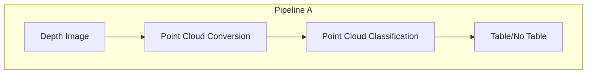
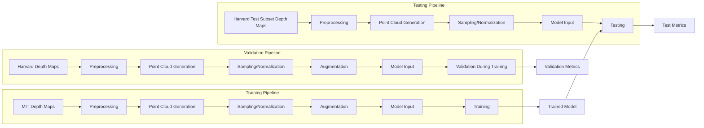

# System Patterns: Table Detection from 3D Point Clouds

## Overall Architecture

*(Scope revised to focus solely on Pipeline A)*

The project implements Pipeline A, following a modular architecture:



## Common Design Patterns (Applied to Pipeline A)

1. **Pipeline Pattern**: Pipeline A follows a sequential processing pipeline where the output of one component serves as input to the next.

2. **Factory Pattern**: Model creation is abstracted through factory methods that instantiate the appropriate model architecture based on configuration parameters.

3. **Strategy Pattern**: Different processing strategies (e.g., sampling methods, augmentation techniques) can be selected through configuration.

4. **Repository Pattern**: Data access is abstracted through dataset classes that handle loading and preprocessing of different data types.

5. **Observer Pattern**: Training progress is monitored through callbacks that report metrics to TensorBoard for visualization.

## Pipeline A: Depth to Point Cloud Classification

### Components

1. **Data Processing**:
   - `depth_to_pointcloud.py`: Converts depth maps to 3D point clouds
   - `dataset.py`: Handles data loading and preprocessing. Now supports multiple `data_spec` formats: sequence dict (train), frame lists (val/test1), and custom dataset config dict (e.g., for 'ucl' dataset, loading labels from text file).
   - `preprocessing.py`: Contains point cloud preprocessing functions
   - **Data split (Under Review 2025-04-07)**: Original split (MIT=Train, Harvard=Val/Test pool) yielded best balanced results. Domain adaptation split (MIT+`harvard_tea_2`=Train) yielded poor results, possibly due to class imbalance. Final split TBD pending investigation.

2. **Models**:
   - `classifier.py`: Implements neural network architectures for point cloud classification
   - `utils.py`: Provides utility functions for model operations

3. **Training**:
   - `train.py`: Handles model training and validation.
   - `evaluate.py`: Evaluates model performance on specified test sets (Test Set 1: Harvard, Test Set 2: UCL). Reads all configuration from `config.py`.
   - Training uses MIT sequences, validation uses Harvard-Subset1.

4. **Configuration**:
   - `config.py`: Centralizes ALL configuration parameters (data paths, model params, training settings, evaluation settings, visualization settings, dataset specs). Used by `train.py`, `evaluate.py`, `visualize_test_predictions.py`, and `dataset.py`.
   - Loads validation/test frame lists from pickle files.
   - Contains general settings like `SEED`, `DEVICE`, `NUM_WORKERS`.
   - Contains specific settings for evaluation (`EVAL_*`) and visualization (`VIS_*`).

5. **Visualization**:
   - `visualize_test_predictions.py`: Loads a trained model, runs inference on the configured test set, and saves annotated RGB images. Reads all configuration from `config.py`.

### Data Flow



### Key Interfaces

1. **Data Loading Interface**:
   ```python
   # Dataset interface
   class PointCloudDataset(Dataset):
       def __init__(self, data_path, split, transform=None)
       def __getitem__(self, idx)
       def __init__(self, data_root, data_spec, transform=None, augment=False, mode='train', ...)
       def __getitem__(self, idx)
       def __len__()
   ```
   
   The `data_spec` parameter now determines the loading strategy:
   - `dict` (starting with 'mit_'/'harvard_'): Standard training sequences.
   - `list`: Specific frame IDs for validation or standard test sets.
   - `dict` (with 'name' key, e.g., 'ucl'): Custom dataset configuration, loading labels from a specified text file.

2. **Model Interface**:
   ```python
   # Model interface
   class PointCloudClassifier(nn.Module):
       def __init__(self, args)
       def forward(self, x)
   ```
   
   The model architecture (e.g., DGCNN, PointNet) and its parameters (`k`, `emb_dims`, `dropout`, `feature_dropout`) are defined based on `config.py` and command-line arguments in both training and evaluation scripts.

3. **Training Interface**:
   ```python
   # Training interface
   def train_model(model, train_loader, val_loader, criterion, optimizer, scheduler, args)
   def evaluate(model, data_loader, criterion, args) # Can take val_loader or test_loader
   ```
   
   The training process used either MIT sequences (original split) or MIT + `harvard_tea_2` (domain adaptation split). Validation used the corresponding Harvard subset.
   Final evaluation uses the test set specified by `EVAL_TEST_SET` in `config.py` (1: Corresponding Harvard-Subset2, 2: UCL).

## Cross-Cutting Concerns (Relevant to Pipeline A)

1. **Configuration Management**: Fully centralized in `config.py`. All scripts (`train.py`, `evaluate.py`, `visualize_test_predictions.py`, `dataset.py`) read their parameters directly from this file. No command-line arguments are used.
2. **Logging**: TensorBoard for training metrics, matplotlib for visualizations
3. **Error Handling**: Robust handling of invalid depths, empty point clouds
4. **Performance Monitoring**: Tracking of inference time, memory usage
5. **Evaluation Framework**: Consistent metrics for evaluating Pipeline A's performance.
6. **Dataset Split Management (Under Review 2025-04-07)**:
   - **Original Split**: Training: MIT (~290). Validation: Harvard-Subset1 (48). Test Set 1: Harvard-Subset2 (50).
   - **Domain Adaptation Split**: Training: MIT + `harvard_tea_2` (~305). Validation: Harvard-Subset1 excl. `harvard_tea_2` (24). Test Set 1: Harvard-Subset2 excl. `harvard_tea_2` (50).
   - **Test Set 2 (Consistent)**: Custom 'ucl' dataset (RealSense capture, raw depth).
   - **Status**: Final split TBD pending class balance investigation of the Domain Adaptation training set. Original split currently has best results.
