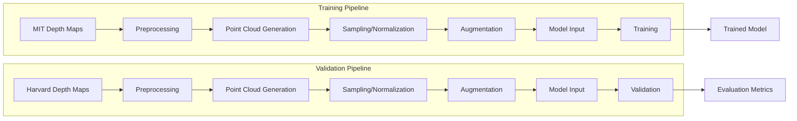
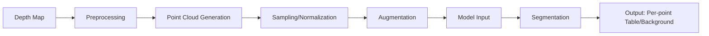

# System Patterns: Table Detection from 3D Point Clouds

## Overall Architecture

The project follows a modular architecture with three distinct pipelines, each representing a different approach to table detection:

```mermaid
graph TD
    subgraph "Pipeline A"
        A1[Depth Image] --> A2[Point Cloud Conversion]
        A2 --> A3[Point Cloud Classification]
        A3 --> A4[Table/No Table]
    end
    
    subgraph "Pipeline B"
        B1[RGB Image] --> B2[Depth Estimation]
        B2 --> B3[Depth Classification]
        B3 --> B4[Table/No Table]
    end
    
    subgraph "Pipeline C"
        C1[Depth Image] --> C2[Point Cloud Conversion]
        C2 --> C3[Point Cloud Segmentation]
        C3 --> C4[Pointwise Table/Background]
    end
```



## Common Design Patterns

1. **Pipeline Pattern**: Each solution follows a sequential processing pipeline where the output of one component serves as input to the next.

2. **Factory Pattern**: Model creation is abstracted through factory methods that instantiate the appropriate model architecture based on configuration parameters.

3. **Strategy Pattern**: Different processing strategies (e.g., sampling methods, augmentation techniques) can be selected through configuration.

4. **Repository Pattern**: Data access is abstracted through dataset classes that handle loading and preprocessing of different data types.

5. **Observer Pattern**: Training progress is monitored through callbacks that report metrics to TensorBoard for visualization.

## Pipeline A: Depth to Point Cloud Classification

### Components

1. **Data Processing**:
   - `depth_to_pointcloud.py`: Converts depth maps to 3D point clouds
   - `dataset.py`: Handles data loading and preprocessing
   - `preprocessing.py`: Contains point cloud preprocessing functions
   - Data split is now restructured: MIT sequences for training, Harvard sequences for validation

2. **Models**:
   - `classifier.py`: Implements neural network architectures for point cloud classification
   - `utils.py`: Provides utility functions for model operations

3. **Training**:
   - `train.py`: Handles model training and validation
   - `evaluate.py`: Evaluates model performance on validation data
   - Training now uses MIT sequences with strong regularization

4. **Configuration**:
   - `config.py`: Centralizes configuration parameters
   - Contains dataset split configuration and regularization parameters

### Data Flow



### Key Interfaces

1. **Data Loading Interface**:
   ```python
   # Dataset interface
   class PointCloudDataset(Dataset):
       def __init__(self, data_path, split, transform=None)
       def __getitem__(self, idx)
       def __len__()
   ```
   
   The split parameter now determines whether to load MIT data (for training) 
   or Harvard data (for validation).

2. **Model Interface**:
   ```python
   # Model interface
   class PointCloudClassifier(nn.Module):
       def __init__(self, args)
       def forward(self, x)
   ```
   
   The model now includes enhanced regularization techniques to ensure generalization to the Harvard validation set.

3. **Training Interface**:
   ```python
   # Training interface
   def train_model(model, train_loader, val_loader, criterion, optimizer, scheduler, args)
   def evaluate(model, validation_loader, criterion, args)
   ```
   
   The training process now uses MIT sequences for training and Harvard sequences for validation,
   with regularization parameters tuned for better generalization to the validation set.

## Pipeline B: RGB to Depth to Classification

### Components

1. **Depth Estimation**: Model to convert RGB images to depth maps
2. **Classification**: Model to classify depth maps for table detection
3. **Data Processing**: Utilities for RGB processing and depth estimation
4. **Training/Evaluation**: Scripts for training and evaluation

### Data Flow


## Pipeline C: Depth to Point Cloud Segmentation

### Components

1. **Point Cloud Generation**: Convert depth maps to point clouds
2. **Segmentation Model**: Classify each point as table or background
3. **Evaluation**: Metrics and visualization for point cloud segmentation

### Data Flow



## Cross-Cutting Concerns

1. **Configuration Management**: Centralized in `config.py` with command-line overrides
2. **Logging**: TensorBoard for training metrics, matplotlib for visualizations
3. **Error Handling**: Robust handling of invalid depths, empty point clouds
4. **Performance Monitoring**: Tracking of inference time, memory usage
5. **Evaluation Framework**: Consistent metrics across pipelines for fair comparison
6. **Dataset Split Management**: 
   - MIT sequences used for training (larger dataset, ~290 frames)
   - Harvard sequences used for validation (smaller dataset, ~98 frames)
   - Strong regularization to ensure generalization to validation set
   - Monitoring of generalization performance across datasets
