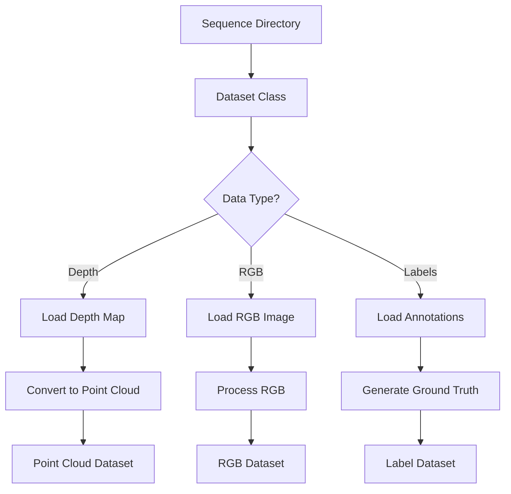

# Technical Context: Table Detection from 3D Point Clouds

## Development Environment

The project is developed in a Python environment with the following requirements:

```
# From requirements.txt
Python 3.8+
PyTorch 1.8+
Open3D
NumPy
OpenCV
SciPy
Matplotlib
```

## Core Technologies

### Point Cloud Processing

- **Open3D**: Library for working with 3D data, particularly point clouds
- **NumPy**: Foundation for numerical operations on arrays and matrices
- **SciPy**: Scientific computing library used for spatial operations and algorithms

### Deep Learning

- **PyTorch**: Deep learning framework for model development and training
- **CUDA**: For GPU acceleration of model training and inference (if available)
- **TensorBoard**: For visualization of training metrics and progress

### Computer Vision

- **OpenCV**: For image processing operations, especially on RGB and depth data
- **Matplotlib**: For visualization of images, point clouds, and results

## Key Technical Components

### Point Cloud Generation

The depth-to-point-cloud conversion utilizes camera intrinsic parameters to project depth pixels into 3D space:

```python
# Pseudo-code for depth to point cloud conversion
def depth_to_pointcloud(depth_map, intrinsics):
    # Create meshgrid of pixel coordinates
    h, w = depth_map.shape
    x, y = np.meshgrid(np.arange(w), np.arange(h))
    
    # Convert to homogeneous coordinates
    x = (x - intrinsics[0, 2]) / intrinsics[0, 0]
    y = (y - intrinsics[1, 2]) / intrinsics[1, 1]
    
    # Multiply by depth to get 3D coordinates
    z = depth_map
    x = x * z
    y = y * z
    
    # Stack to create point cloud
    points = np.stack((x, y, z), axis=-1)
    
    # Reshape and filter invalid points
    points = points.reshape(-1, 3)
    valid_mask = z.reshape(-1) > 0
    
    return points[valid_mask]
```

### Point Cloud Preprocessing

Point clouds undergo several preprocessing steps:

1. **Filtering**: Removal of invalid points (NaN, infinity, zero depth)
2. **Downsampling**: Uniform or FPS (Farthest Point Sampling) to reduce point count
3. **Normalization**: Scaling to unit sphere and centering
4. **Augmentation**: Random rotation, scaling, and jittering (training only)

### Neural Network Architectures

The project supports two main architectures for point cloud classification:

1. **DGCNN (Dynamic Graph CNN)**:
   - Constructs dynamic graphs in feature space
   - Uses EdgeConv operations for better geometric understanding
   - More robust to point cloud variations

2. **PointNet**:
   - Pioneering architecture for point cloud processing
   - Respects permutation invariance through max pooling
   - Simpler architecture with fewer parameters

## Data Management

### Dataset Organization

The data is organized into sequences from different locations:

```
data/
├── MIT/ (Training)
│   ├── mit_32_d507/
│   ├── mit_76_459/
│   ├── mit_76_studyroom/
│   ├── mit_gym_z_squash/
│   └── mit_lab_hj/
├── Harvard/ (Test 1)
│   ├── harvard_c5/
│   ├── harvard_c6/
│   ├── harvard_c11/
│   └── harvard_tea_2/
└── RealSense/ (Test 2)
    └── [custom captured data]
```

Each sequence contains:
- Depth maps (.png or .npy)
- RGB images (.jpg or .png)
- Polygon annotations (format varies)

### Data Loading Pipeline



## Configuration System

The system uses a centralized configuration approach:

1. **Base Configuration**: Default parameters defined in `config.py`
2. **Command-Line Override**: Arguments passed via CLI take precedence
3. **Run-Specific Configuration**: Stored with model checkpoints for reproducibility

## Deployment & Evaluation

### Model Checkpointing

Models are saved during training with the following information:
- Model weights
- Training configuration
- Optimization state
- Best validation metrics

### Visualization

Results are visualized through:
- 3D interactive point cloud visualizations
- Confusion matrices for classification results
- PR and ROC curves for model performance
- TensorBoard dashboards for training metrics

### Metrics Tracking

The system tracks key metrics:
- Accuracy
- Precision
- Recall
- F1-score
- AUC-ROC
- Confusion matrix
